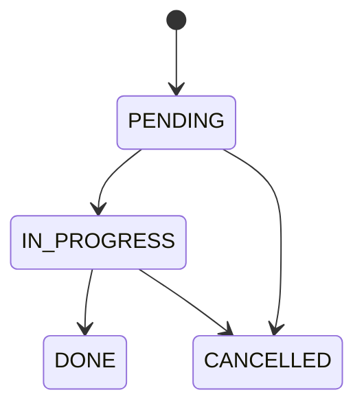

# Repair Request State Diagram

This diagram describes the allowed status transitions of a repair request.

```mermaid
stateDiagram-v2
    [*] --> PENDING

    PENDING --> IN_PROGRESS
    PENDING --> CANCELLED

    IN_PROGRESS --> DONE
    IN_PROGRESS --> CANCELLED
```